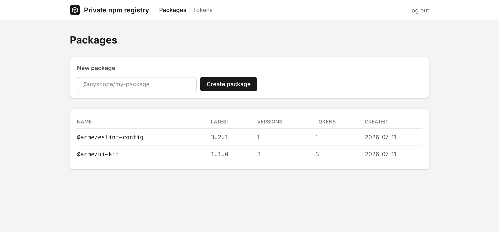
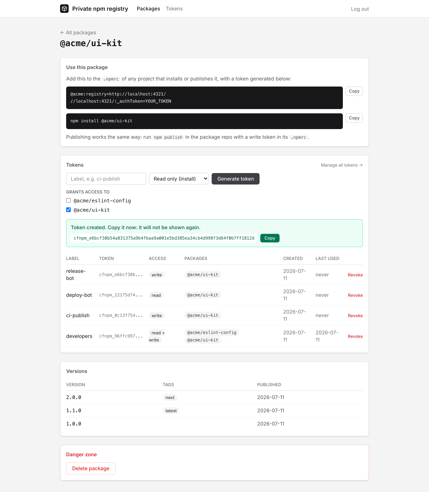
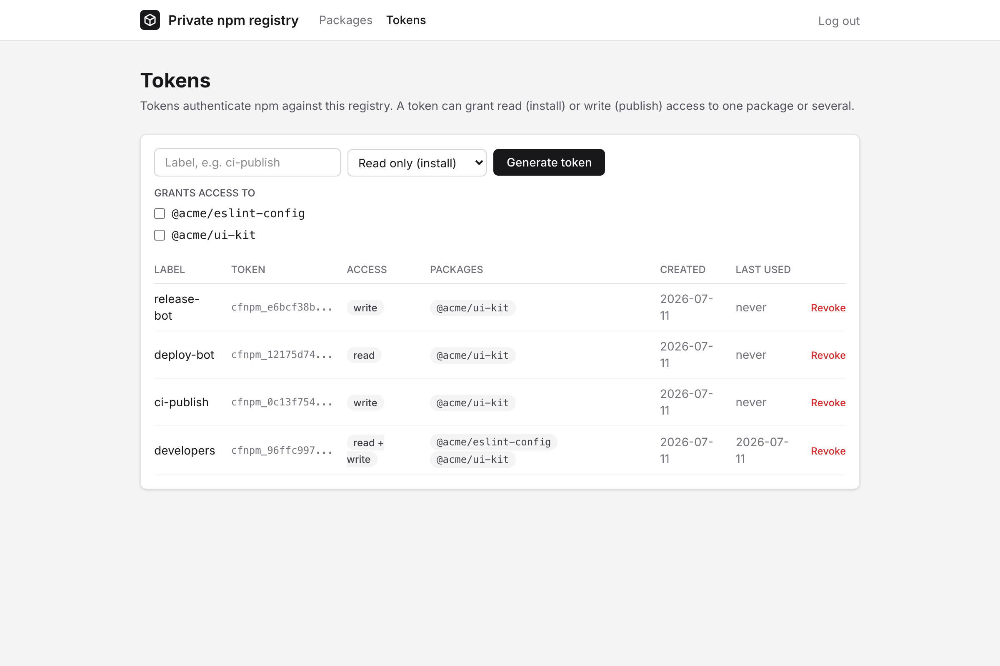
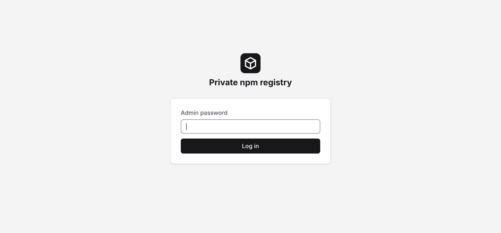

# cf-npm-private-registry

A self-hosted npm registry for private packages that runs entirely on Cloudflare Workers, with D1 for metadata and R2 for tarballs.

**The goal: let you host scoped private npm packages without paying.** npm charges per user per month for private packages. This registry runs comfortably inside Cloudflare's free tier (Workers, D1, and R2 all have generous free quotas, and R2 has no egress fees), so a small team can publish and install private packages for free.

## What you get

- A real npm registry: `npm install`, `npm publish`, `npm view`, `npm deprecate`, `npm dist-tag`, and `npm unpublish` all work against it.
- A password-protected web UI to create packages and manage tokens. The password check uses Cloudflare's built-in constant-time comparison (`crypto.subtle.timingSafeEqual`).
- Access tokens with three permission levels: read only (install), write only (publish), or read and write. A token can grant access to a single package or to several at once, and each package can have as many tokens as you like.
- Tokens are stored as SHA-256 hashes and shown exactly once at creation.
- No proxying of the public registry by default. Requests for packages you do not host return 404 unless you opt in (see [Proxying the public registry](#proxying-the-public-registry)).

## Screenshots

The UI follows your system's light or dark theme automatically, and so do these screenshots.

The dashboard lists your packages with their latest version, version count, and token count:

<picture>
  <source media="(prefers-color-scheme: dark)" srcset="docs/screenshots/dashboard-dark.png" />
  
</picture>

Each package page has ready-to-paste `.npmrc` and install snippets, token management (tokens are shown exactly once, right after creation), the published versions with their dist-tags, and a danger zone:

<picture>
  <source media="(prefers-color-scheme: dark)" srcset="docs/screenshots/package-dark.png" />
  
</picture>

The tokens page manages every token in one place, including tokens that span multiple packages:

<picture>
  <source media="(prefers-color-scheme: dark)" srcset="docs/screenshots/tokens-dark.png" />
  
</picture>

The UI sits behind a single admin password:

<picture>
  <source media="(prefers-color-scheme: dark)" srcset="docs/screenshots/login-dark.png" />
  
</picture>

## How it works

Package names must be scoped (`@yourscope/yourpackage`). That is what makes the "no proxy" setup work: your projects keep installing everything else from the public npm registry, and only requests for your scope go to this one.

- **Workers** serve both the npm protocol endpoints and the admin UI (an Astro + Vue app).
- **D1** stores packages, versions, dist-tags, and token hashes.
- **R2** stores the package tarballs.

## Deploy

You need a Cloudflare account (the free plan is fine) and `node >= 22`.

```sh
git clone https://github.com/Calvin-LL/cf-npm-private-registry.git
cd cf-npm-private-registry
npm install
npx wrangler login
```

1. Create the D1 database and copy the printed `database_id` into `wrangler.jsonc` (replace `REPLACE_WITH_YOUR_D1_DATABASE_ID`):

   ```sh
   npx wrangler d1 create npm-registry
   ```

2. Create the R2 bucket:

   ```sh
   npx wrangler r2 bucket create npm-registry-tarballs
   ```

3. Create the tables:

   ```sh
   npx wrangler d1 migrations apply npm-registry --remote
   ```

4. Set the admin password for the web UI:

   ```sh
   npx wrangler secret put ADMIN_PASSWORD
   ```

5. Build and deploy:

   ```sh
   npm run build
   npx wrangler deploy
   ```

Open the printed `*.workers.dev` URL (or put a custom domain in front of it) and log in with your admin password.

## Usage

### 1. Create a package and a token in the UI

Log in, create a package like `@yourscope/yourpackage`, then generate tokens for it on the package page:

- a **read** token for machines that install it,
- a **write** token for CI that publishes it,
- or a **read and write** token for local development.

When generating a token you pick which packages it grants access to, so one token can cover your whole scope (handy for a developer machine or a CI job that installs several private packages). The tokens page shows every token across all packages. The token value itself is shown once; copy it immediately.

### 2. Point npm at your registry for your scope

Add two lines to the `.npmrc` of any project that uses the package (next to its `package.json`, or in `~/.npmrc` for your whole machine):

```ini
@yourscope:registry=https://your-registry.workers.dev/
//your-registry.workers.dev/:_authToken=cfnpm_your_token_here
```

The first line tells npm to fetch everything under `@yourscope` from your registry; all other packages still come from the public npm registry. The second line attaches your token to every request npm makes to that host. The package page in the UI shows this snippet prefilled for you.

For CI, keep the token out of the repo by referencing an environment variable instead:

```ini
@yourscope:registry=https://your-registry.workers.dev/
//your-registry.workers.dev/:_authToken=${NPM_TOKEN}
```

### 3. Install

```sh
npm install @yourscope/yourpackage
```

pnpm, yarn, and bun read the same `.npmrc` settings and work too.

### 4. Publish

In the repo of the package itself, with a write token in its `.npmrc`:

```sh
npm publish
```

Note that the package must first be created in the UI: tokens grant access per package, so there is nothing to authenticate against before it exists. Version conflicts are rejected (you cannot overwrite an already-published version), and `npm publish --tag beta`, `npm deprecate`, `npm dist-tag`, and `npm unpublish` behave like they do on the public registry.

## Proxying the public registry

By default this registry only answers for the packages it hosts; anything else gets a 404. That is intentional, because the recommended per-scope `.npmrc` setup never sends other requests here anyway.

If you want to point npm at this registry for **everything** (a single `registry=` line instead of a scoped one), enable upstream proxying by setting the `PROXY_UPSTREAM` variable to `"true"` in `wrangler.jsonc` (or in the Cloudflare dashboard) and redeploying:

```jsonc
"vars": {
  "PROXY_UPSTREAM": "true",
  "UPSTREAM_REGISTRY": "https://registry.npmjs.org"
}
```

With proxying on, a project's `.npmrc` needs just one `registry=` line instead of a scoped mapping, and every package (public or private) is requested through your registry:

```ini
registry=https://your-registry.workers.dev/
//your-registry.workers.dev/:_authToken=cfnpm_your_token_here
```

Requests for unknown packages (and npm audit calls) are then forwarded to `UPSTREAM_REGISTRY` without your credentials. Your private packages are still served locally and still require tokens; public packages need no permissions at all.

## For AI agents

The deployed registry serves [`/llms.txt`](public/llms.txt), a plain-text reference covering the whole HTTP API: how to log in with the admin password, create and delete packages, mint and revoke tokens (including multi-package tokens), and talk to the npm protocol endpoints directly. An agent that knows the registry URL and the admin password can manage everything from that file alone; point it at `https://your-registry.workers.dev/llms.txt`.

## Security notes

- UI sessions are signed HMAC cookies derived from the admin password. Changing the password invalidates all sessions.
- Registry tokens are random 256-bit values, stored only as SHA-256 hashes. The UI shows a short prefix so you can tell tokens apart later.
- A token only ever grants access to the packages you selected when creating it, limited to the read or write permissions you picked.
- Everything (packuments and tarballs included) requires a token; nothing about your private packages is publicly readable.

## Local development

```sh
npm install
cp .dev.vars.example .dev.vars   # set ADMIN_PASSWORD
npx wrangler d1 migrations apply npm-registry --local
npm run dev                      # UI + registry on http://localhost:4321
```

`npm run build && npm run preview` runs the built worker in workerd, which is closest to production. Useful scripts: `npm run check` (typecheck), `npm run format` (prettier).

## License

MIT
